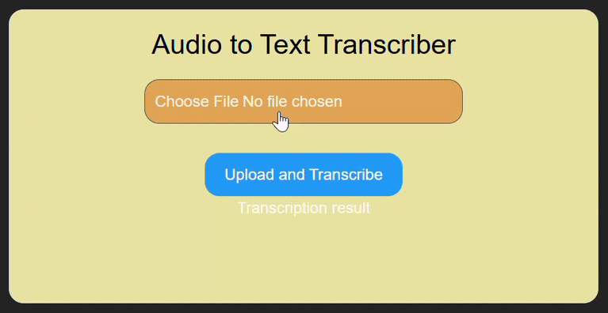

# 🔊 Audio Transcriber App  

A lightweight application that uses **[OpenAI Transcriptions](https://docs.spring.io/spring-ai/reference/api/audio/transcriptions/openai-transcriptions.html)** to convert audio files into text!  

### 🛠️ Tech Stack  
- **Frontend:** React + TailwindCSS  
- **Backend:** Spring Boot + Spring AI  

  

---

## 🚀 How to Use  
1. **Record or Convert Audio**  
   - Use your computer’s microphone or an online tool like [TTSMP3](https://ttsmp3.com/) to generate an audio file (`.mp3`, `.wav`, etc.).  
2. **Upload & Transcribe**  
   - Click **`Choose File`** to upload your audio.  
   - Click **`Upload and Transcribe`** and wait for the result!  

---

## ⚙️ How It Works  
- The backend sends an API request to **OpenAI’s Whisper model** for transcription.  
- The transcribed text is returned and displayed on the frontend.  

---

## 💻 Local Setup  

### **Backend (Spring Boot)**  

#### **Step 1: Initialize Project**  
Go to **[Spring Initializr](https://start.spring.io/)** and configure:  
- **Project:** Maven  
- **Language:** Java  
- **Spring Boot:** (Latest stable version, **not SNAPSHOT**)  
- **Packaging:** JAR  
- **Java:** (Choose your version)  
- **Dependencies:** `Spring Web` + `OpenAI`  
- **Project Name:** `audio-transcriber`  

Click **`GENERATE`**, then download and extract the project.  

#### **Step 2: Replace Source Code**  
```bash
git clone [your-backend-repo-url]  
cd audio-transcriber  
# Delete existing src/main/java and replace with the provided code  
```

#### **Step 3: Configure OpenAI API Key**  
Edit `src/main/resources/application.properties`:  
```properties
spring.application.name=audio-transcribe  
spring.ai.openai.api-key=your-api-key-here  # 🔑 Get from OpenAI  
spring.ai.openai.audio.transcription.base-url=https://api.openai.com  
spring.ai.openai.audio.transcription.options.model=whisper-1  
spring.ai.openai.audio.transcription.options.response-format=json  
```

#### **Step 4: Run the Backend**  
- Open in **IntelliJ** (or your preferred IDE).  
- Run `AudioTranscribeApplication`.  

---

### **Frontend (React)**  

#### **Step 5: Set Up & Run**  
```bash
git clone [your-frontend-repo-url]  
cd frontend  
npm install   # Install dependencies
npm run dev   # Runs on http://localhost:5173  
```

---

### 🔑 Notes  
- Ensure your **OpenAI API key** is created (check [here](https://platform.openai.com/settings/organization/api-keys)) and you have sufficient credits (check at your `Billing`)  
- The backend runs on `http://localhost:8080` by default.  

---

🎉 **Done!** Now upload an audio file and see the magic happen.